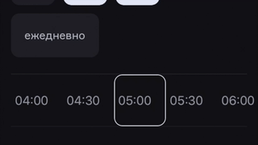

# HorizontalScrollPicker

This is a small react-native library for picking item from horizontall scroll

- Contains some fixes for Android
- Based on ScrollView from `react-native-gesture-handlers` for better ineroperability with `reanimated-bottom-sheet` or `react-native-modalize`



---

## Usage

1) Install react-native-gesture handler. If you are using Expo - it sould work out of box.

```
import _ from 'lodash';
import { HorizontalScrollPicker } from 'react-native-horizontal-scroll-picker';
import styles from './MyComponentStyles';

const timeItems = _.map(['11:00', '12:00', '13:00', '14:00', '15:00', '16:00', '17:00', '18:00', '19:00'], (time, idx) => {
    return {
       label: time,
       value: idx
    }
}});
...

<HorizontalScrollPicker
    items={timeItems}
    textStyle={styles.time}
    selectedTextStyle={styles.selectedTime}
    containerStyle={styles.scrollPickerContainer}
    itemStyle={styles.item}
    selectorStyle={styles.selector}
    onSelect={onSelect}
    initialIdx={initialIdx}
/>
```


Special thanks to Alexei - https://github.com/gvoz
